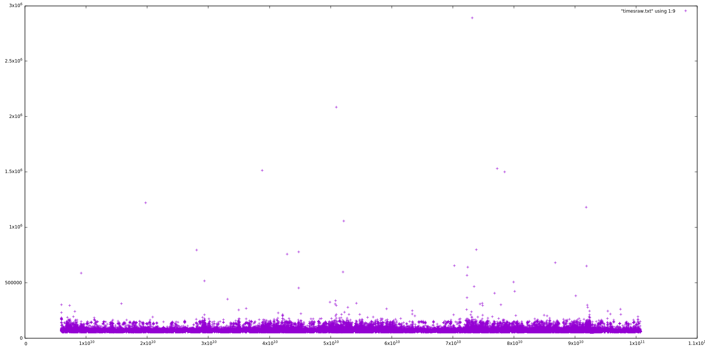
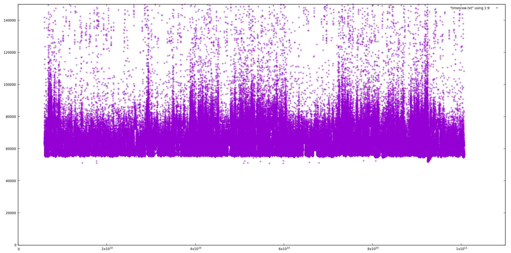
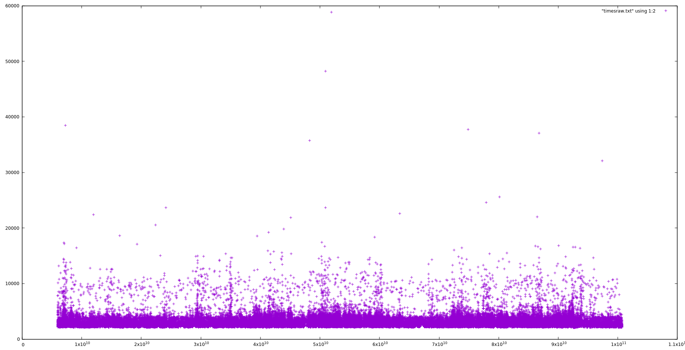
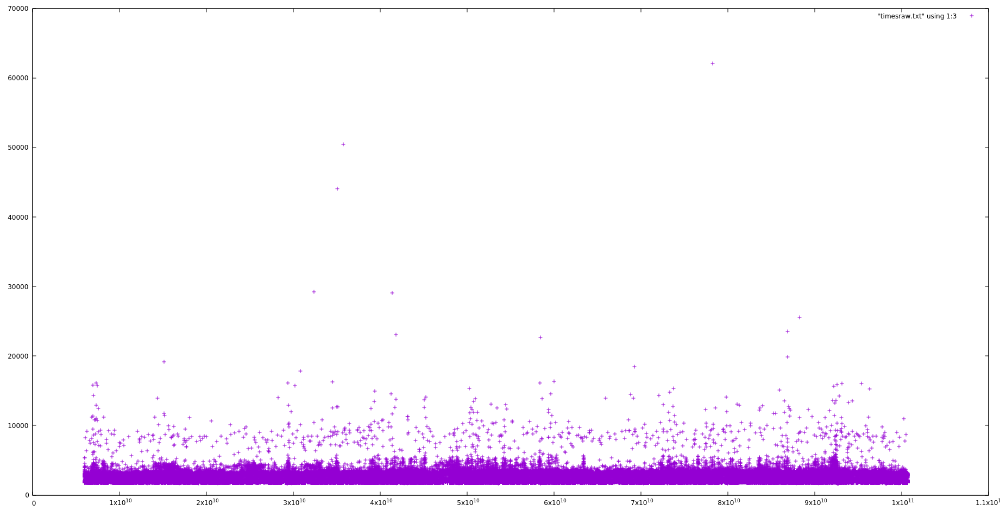
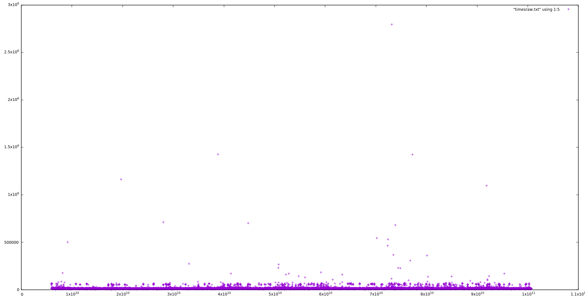
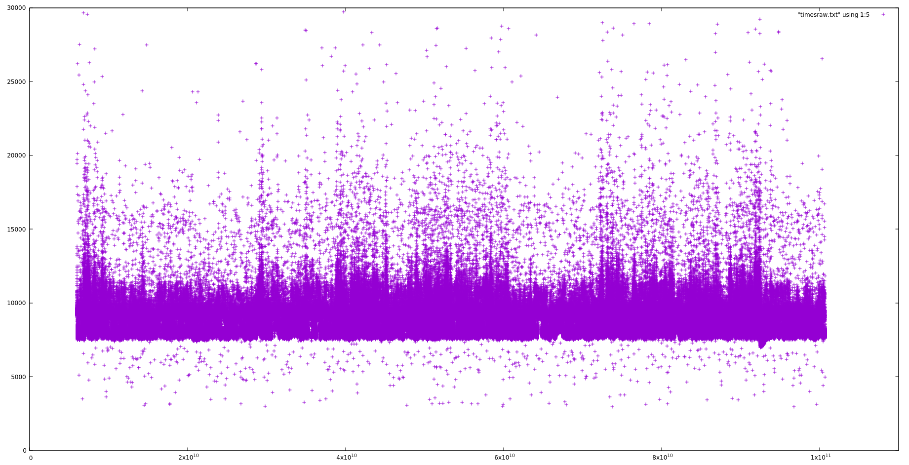
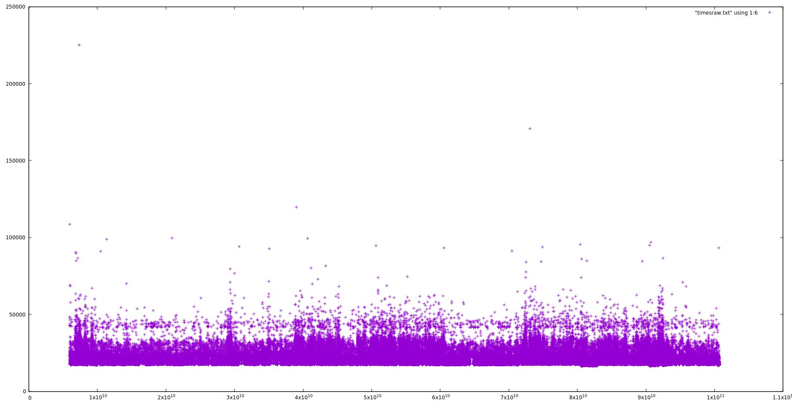
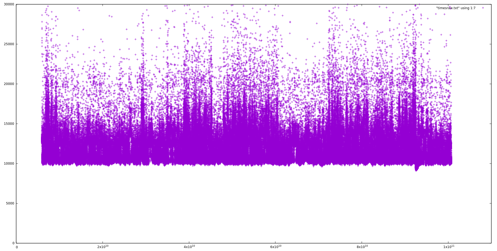
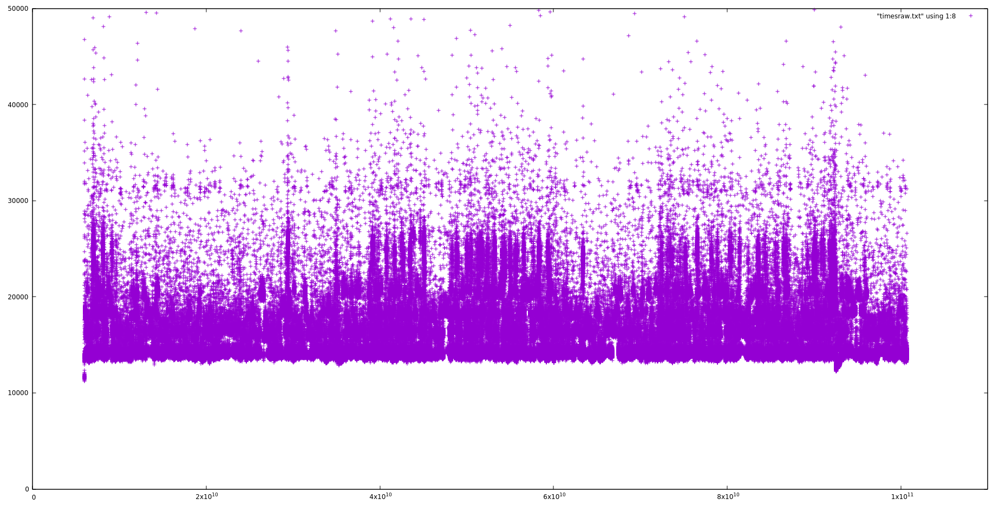

# The life of a request in ArangoDB

We investigate times spent in various parts of the infrastructure.
We compile with all optimizations, including LTO and execute on
a modern machine with Turbo mode switched off. The absolute times
are less interesting than the ratio between them, since with
Turbo mode, things will be considerably faster.

We measure the following times using `bpftrace`:

```
  Absolute time since script start (all times in nanoseconds)
  CommTask::processRequest -> CommTask::prepareExecution
  CommTask::prepareExecution -> CommTask::executeRequest
  CommTask::executeRequest -> CommTask::handleRequestSync
  CommTask::handleRequestSync -> RestHandler::executeEngine
  RestHandler::executeEngine -> CommTask::sendResponse
  CommTask::sendResponse -> CommTask::writeResponse
  CommTask::writeResponse -> CommTask::responseWritten
  Total time for request until response written
```

## `/_api/version` without TLS and with HTTP/1.1 over localhost

```
  CommTask::processRequest -> CommTask::prepareExecution      3 us
  CommTask::prepareExecution -> CommTask::executeRequest      2 us
  CommTask::executeRequest -> CommTask::handleRequestSync     2 us
  CommTask::handleRequestSync -> RestHandler::executeEngine   9 us
  RestHandler::executeEngine -> CommTask::sendResponse       18 us
  CommTask::sendResponse -> CommTask::writeResponse          11 us
  CommTask::writeResponse -> CommTask::responseWritten       15 us
  ----------------------------------------------------------------
  Total time for request until response written              60 us
```

If we compare this with the client side statistics, we see:

```
      50.00%         80.00%         85.00%         90.00%         95.00%         99.00%
0.08980000ms   0.10480000ms   0.11230000ms   0.11980000ms   0.12730000ms   0.13480000ms

```

So the 60 us on the server are seen as 90 us on the client in the median.
Without the `bpftrace` running, this goes down to 70 us. This means that
the whole network transfer happens in approximately 10 us, and that the
time for the measurement is approximately 20 us, which is basically
two `printf` statements in the `bpftrace` program.

One comment about the Turbo-Mode of the CPU. When I switch the
Turbo-Mode on again, I can easily get the 70 us client side down to
29 us, simply because the CPU frequency goes up from 1.8 GHz to
something between 4.4 GHz and 4.8 GHz, obviously depending on the
load on the system and the CPU temperature.

Let's look at the details within the server.

The total time spent has this statistics:
```
   Min. 1st Qu.  Median    Mean 3rd Qu.    Max. 
  50815   56862   60017   62411   64593 2890129 

   50%    90%    99%  99.9% 99.99% 
 60017  73724  87258 136061 178574 
```

(all times in nanoseconds, this is time spent from the moment when the
request has been read in its entirety until the response has been sent
out).

Overall, we see approximately 60 us (microseconds) for a typical request.

Here is a logarithmic histogram:

```
[32K, 64K)        792482 |@@@@@@@@@@@@@@@@@@@@@@@@@@@@@@@@@@@@@@@@@@@@@@@@@@@@|
[64K, 128K)       206229 |@@@@@@@@@@@@@                                       |
[128K, 256K)        1245 |                                                    |
[256K, 512K)          26 |                                                    |
[512K, 1M)            11 |                                                    |
[1M, 2M)               7 |                                                    |
[2M, 4M)               1 |                                                    |
```

And here a plot to see the jitter:



Let's zoom in by limiting the y coordinate to 150000 ns:



That is pretty bad, something we should probably investigate.

Let's go through the different phases:

The statistics for the initial phase in the HttpCommTask until it
calls `prepareExecution`:

```
   Min. 1st Qu.  Median    Mean 3rd Qu.    Max. 
   2044    2364    2458    2652    2862   58846 

   50%    90%    99%  99.9% 99.99% 
  2458   3164   4121   8006  13460 
```



That is not too bad with an overall result of approx. 3 us (microseconds).

Here is the time in the HttpCommTask from `prepareExecution` until
`executeRequest`:

```
  Min. 1st Qu.  Median    Mean 3rd Qu.    Max.
   1690    1852    1901    1984    1985   62113

   50%    90%    99%  99.9% 99.99%
  1901   2076   3310   4998  11409
```

and the plot:



This is really negligible with overall result of approx. 2 us.

The next is from `executeRequest` to `handleRequestSync`:

```
   Min. 1st Qu.  Median    Mean 3rd Qu.    Max. 
   1677    1911    1958    2025    2035   64662 

   50%    90%    99%  99.9% 99.99% 
  1958   2125   3615   6023  12565 
```

and the plot:


This is really negligible with overall result of approx. 2 us.

The next is from `handleRequestSync` until the `RestHandler` class
calls `executeEngine`, the latter is, when the actual request handler
begins:

```
   Min. 1st Qu.  Median    Mean 3rd Qu.    Max. 
   2974    7932    8292    8612    9106 2795426 

   50%    90%    99%  99.9% 99.99% 
  8292   9479  11832  22678  65412 
```



This is really bad in the high percentiles. Let's zoom in:



Overall, we lose 9 us to the thread handover!

The next is the actual execution of the RestHandler:

```
   Min. 1st Qu.  Median    Mean 3rd Qu.    Max.
  16591   17920   18226   19863   21341  224999

   50%    90%    99%  99.9% 99.99%
 18226  23429  33000  44968  60845
```

and the plot:



So the execution takes approximately 18 us.

Note that I compared with `ab` (ApacheBench), which does not allow
deflate encoding. In this way I noticed that just the deflate encoding
costs 13 to 14 us of these 18 us!

After the execution, we have the phase from `sendResponse` to
`writeRespnse`, which is another thread handover back to the IO thread:

```
   Min. 1st Qu.  Median    Mean 3rd Qu.    Max.
   9074   10416   10867   11534   12370 1963696

   50%    90%    99%  99.9% 99.99%
 10867  13734  17359  36901  69261
```

and the plot:



Overall, we spend 11 us for this.

And finally, the time for the actual sending of the data:

```
  Min. 1st Qu.  Median    Mean 3rd Qu.    Max. 
  11228   14003   14366   15742   16544  460988 

   50%    90%    99%  99.9% 99.99% 
 14366  19804  25021  32916  44518 
```

and the plot:



Overall, this is another 15 us or so, but with some variation to higher
times.

Summing up, we get the above mentioned overall times.

## `/_api/version` with TLS and with HTTP/1.1 over localhost

```
  CommTask::processRequest -> CommTask::prepareExecution      3 us
  CommTask::prepareExecution -> CommTask::executeRequest      2 us
  CommTask::executeRequest -> CommTask::handleRequestSync     2 us
  CommTask::handleRequestSync -> RestHandler::executeEngine   9 us
  RestHandler::executeEngine -> CommTask::sendResponse       18 us
  CommTask::sendResponse -> CommTask::writeResponse          11 us
  CommTask::writeResponse -> CommTask::responseWritten       32 us (was without TLS 15)
  ----------------------------------------------------------------
  Total time for request until response written              77 us (was without TLS 60)
```

Stats for total:

```
   Min. 1st Qu.  Median    Mean 3rd Qu.    Max.
  67770   73719   76987   79785   83610 1177540

   50%    90%    99%  99.9% 99.99%
 76987  89319 105612 155246 179497
```

This is all the same, except for the sending of results:

```
  Min. 1st Qu.  Median    Mean 3rd Qu.    Max. 
  26488   29451   29991   31991   31719  124801 

   50%    90%    99%  99.9% 99.99% 
 29991  40605  46019  57132  66142 
```

So we can see that there are some 15 to 17 us spent additionally in the
sending part.

Here are the client side statistics:

```
      50.00%         80.00%         85.00%         90.00%         95.00%         99.00%
0.11840000ms   0.13530000ms   0.14370000ms   0.15220000ms   0.16060000ms   0.16910000ms
```

This shows that the client sees approximately 118 us, which go down to
100 us without `bpftrace` running. So we can see that
the client side encryption/decryption plus the decryption on the server
side (which is so far not included in our server side measurements)
eat another relatively small amount of time.

## Appendix, how these measurements were achieved

The code changes for these measurements are currently in this PR:

https://github.com/arangodb/arangodb/pull/11245

This is still work in progress and experimental. It is not completely
clear whether we want to put the code permanently into ArangoDB.

In any case, it uses a file in `lib/Basics/std.h` which contains macros
to put in DTRACE points.

Then it uses the following scripts in `scripts`:

  - `scripts/measureRequestLife.bt` to do the measurements
  - `scripts/showRequestLife.bt` to demonstrate the DTRACE points
  - `scripts/exampleMeasureMethod.bt` to show other examples how one
    can basically attach to any function or method without recompilation

I will demonstrate all this at some stage in a presentation.

The documentation for `bpftrace` is
[here](https://github.com/iovisor/bpftrace/blob/master/docs/reference_guide.md).

Once I have the raw measurements, I use the R language for statistical
analysis, this script `stats` does all I do with a file which has one number
in each line:

```
#!/usr/bin/fish
set f $argv[1]
Rscript -e 'summary(as.numeric(readLines("stdin")))' < $f
echo
Rscript -e 'quantile(as.numeric(readLines("stdin")), probs=c(0.5, 0.9, 0.99, 0.9
99, 0.9999))' < $f
```

From the original output of `scripts/exampleMeasureMethod.bt` I use an
editor to cut away the comment and summary lines to get to the raw data.
I then use 

```
cut -f 9 -d " " < measurements.txt > onecolumn.txt
```

and then I can do

```
stats onecolumn.txt
```

The plots are done with gnuplot and commands like this:

```
plot [t=0:1.1e11] [y=0:40000] "measurements.txt" using 1:9
```

