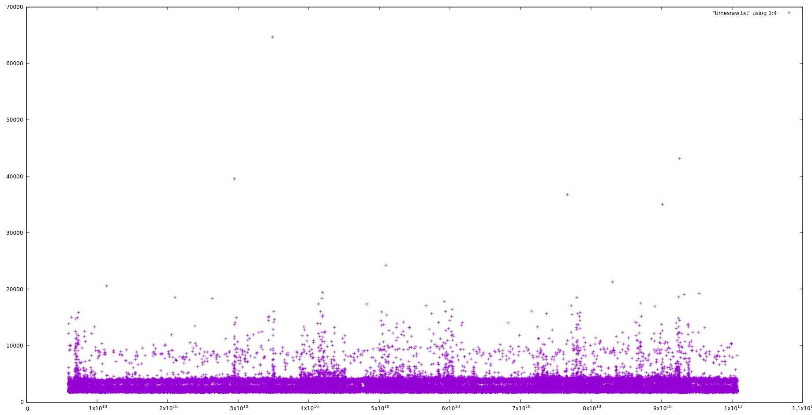

# The life of a request in ArangoDB

We investigate times spent in various parts of the infrastructure.
We compile with all optimizations, including LTO and execute on
a modern machine with Turbo mode switched off. The absolute times
are less interesting than the ratio between them, since with
Turbo mode, things will be considerably faster.

We measure the following times using `bpftrace`:

```
  Absolute time since script start (all times in nanoseconds)
  CommTask::processRequest -> CommTask::prepareExecution
  CommTask::prepareExecution -> CommTask::executeRequest
  CommTask::executeRequest -> CommTask::handleRequestSync
  CommTask::handleRequestSync -> RestHandler::executeEngine
  RestHandler::executeEngine -> CommTask::sendResponse
  CommTask::sendResponse -> CommTask::writeResponse
  CommTask::writeResponse -> CommTask::responseWritten
  Total time for request until response written
```

## `/_api/version` without TLS and with HTTP/1.1 over localhost

The total time spent has this statistics:

```
   Min. 1st Qu.  Median    Mean 3rd Qu.    Max. 
  50815   56862   60017   62411   64593 2890129 

   50%    90%    99%  99.9% 99.99% 
 60017  73724  87258 136061 178574 
```

(all times in nanoseconds, this is time spent from the moment when the
request has been read in its entirety until the response has been sent
out).

Overall, we see approximately 60 us (microseconds) for a typical request.

Here is a logarithmic histogram:

```
[32K, 64K)        792482 |@@@@@@@@@@@@@@@@@@@@@@@@@@@@@@@@@@@@@@@@@@@@@@@@@@@@|
[64K, 128K)       206229 |@@@@@@@@@@@@@                                       |
[128K, 256K)        1245 |                                                    |
[256K, 512K)          26 |                                                    |
[512K, 1M)            11 |                                                    |
[1M, 2M)               7 |                                                    |
[2M, 4M)               1 |                                                    |
```

And here a plot to see the jitter:


Let's zoom in by limiting the y coordinate to 150000 ns:


That is pretty bad, something we should probably investigate.

Let's go through the different phases:

The statistics for the initial phase in the HttpCommTask until it
calls `prepareExecution`:

```
   Min. 1st Qu.  Median    Mean 3rd Qu.    Max. 
   2044    2364    2458    2652    2862   58846 

   50%    90%    99%  99.9% 99.99% 
  2458   3164   4121   8006  13460 
```


That is not too bad with an overall result of approx. 2.5 us (microseconds).

Here is the time in the HttpCommTask from `prepareExecution` until
`executeRequest`:

```
  Min. 1st Qu.  Median    Mean 3rd Qu.    Max.
   1690    1852    1901    1984    1985   62113

   50%    90%    99%  99.9% 99.99%
  1901   2076   3310   4998  11409
```

and the plot:


This is really negligible with overall result of approx. 2 us.

The next is from `executeRequest` to `handleRequestSync`:

```
   Min. 1st Qu.  Median    Mean 3rd Qu.    Max. 
   1677    1911    1958    2025    2035   64662 

   50%    90%    99%  99.9% 99.99% 
  1958   2125   3615   6023  12565 
```

and the plot:



This is really negligible with overall result of approx. 2 us.

The next is from `handleRequestSync` until the `RestHandler` class
calls `executeEngine`, the latter is, when the actual request handler
begins:

```
   Min. 1st Qu.  Median    Mean 3rd Qu.    Max. 
   2974    7932    8292    8612    9106 2795426 

   50%    90%    99%  99.9% 99.99% 
  8292   9479  11832  22678  65412 
```


This is really bad in the high percentiles. Let's zoom in:


The next 
